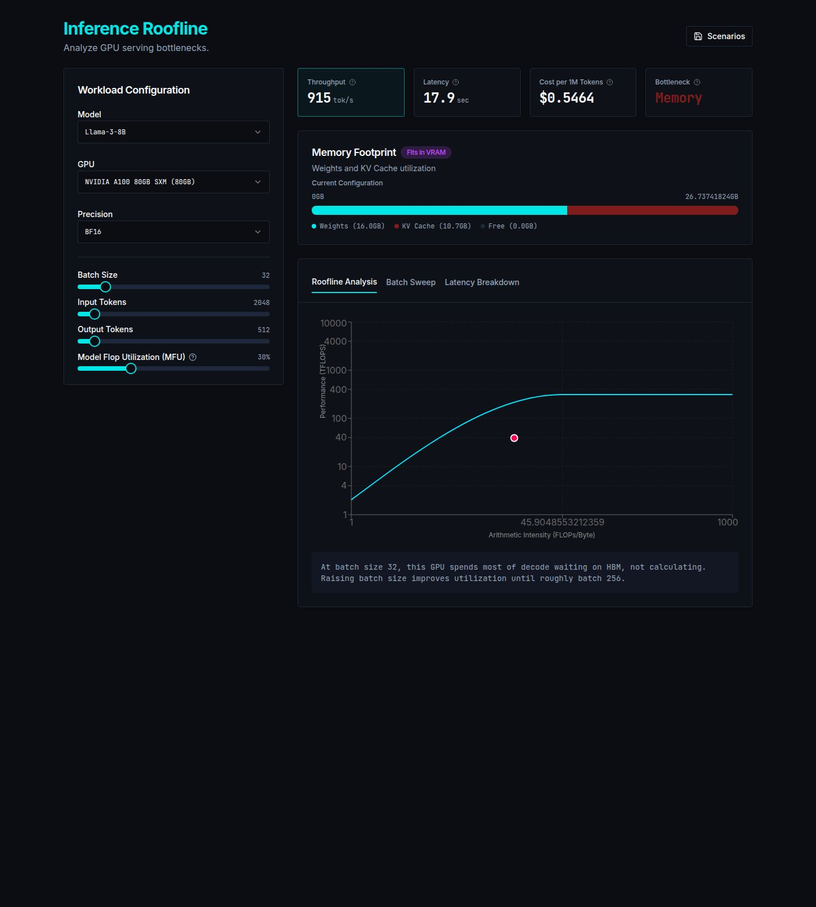

# Inference Roofline

Inference Roofline is an interactive calculator for estimating LLM serving latency, throughput, GPU memory use, and cost. Select a model, GPU, precision, batch size, sequence lengths, and model FLOPs utilization to see the prefill/decode split and the active roofline bottleneck.

[Open the live Inference Roofline app](https://inference-roofline.replit.app/)

## Run

Use the configured API Server and Inference Roofline web workflows. Run `pnpm run typecheck` for static checks and `pnpm --filter @workspace/api-server test` for estimator tests.

## Assumptions and limitations

This is an analytical roofline estimate, not a benchmark. It assumes dense BF16 peak compute scaled by a user-selected MFU and sustained headline HBM bandwidth. Resident weight memory assumes all MoE experts stay in VRAM, while per-step traffic assumes only routed experts are read; that traffic assumption is optimistic at large batch sizes because different tokens can route to different experts. KV-cache traffic uses its average size over generation, while the memory footprint uses its peak size. Prefill FLOPs ignore the O(S²) attention term, so time-to-first-token is underestimated at long context. The model is single-device only: it includes no tensor or pipeline parallelism and no interconnect cost. It also omits kernel launch overhead, quantization metadata, allocator fragmentation, speculative decoding, and serving scheduler effects, so real systems may differ substantially.

## Review notes

The initial specification was LLM-assisted and contained a modeling error: it defined MoE weight memory using active parameters. Reviewing the generated implementation against hand-computed values caught the issue. The estimator now separates the bytes required to keep all weights resident from the active-weight bytes read per decode step.